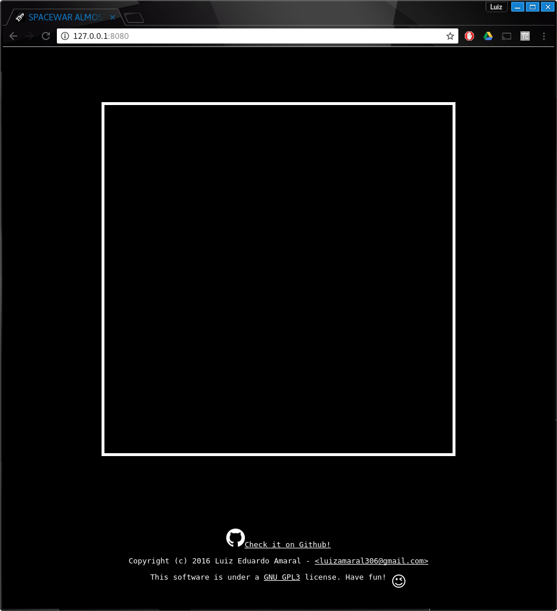
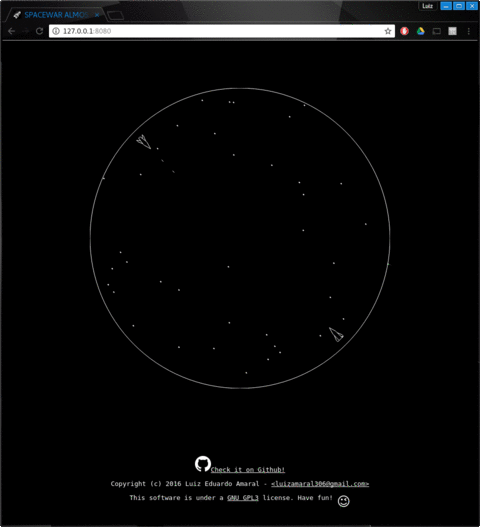
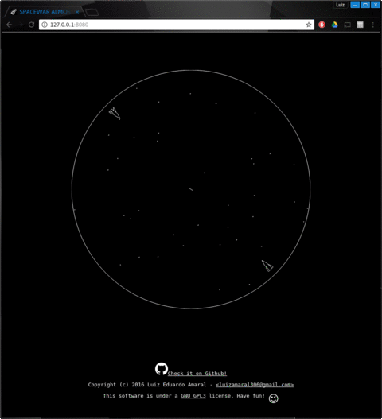
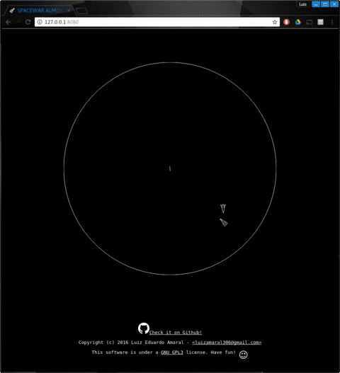
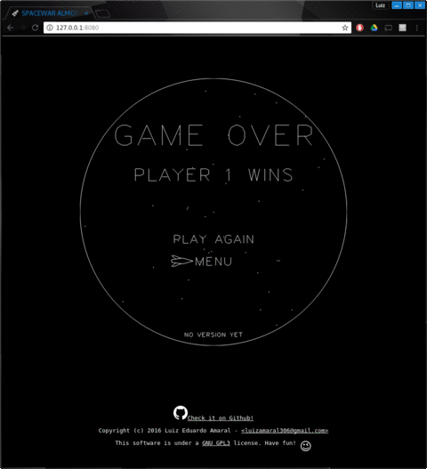
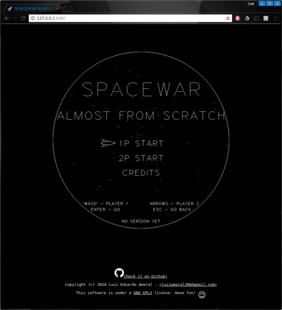
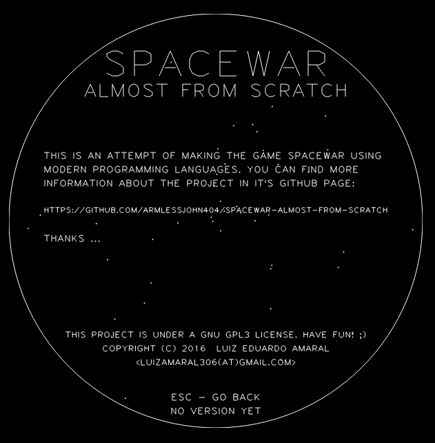

# SPACEWAR ALMOST FROM SCRATCH
This is an attempt of reproducing the game [spacewar!](https://en.wikipedia.org/wiki/Spacewar!) using modern programming languages. The idea is to track the progress and time each stage of development in this document. If possible, I want to finish this project in under 24h.

#### Check it out [here](https://armlessjohn404.github.io/spacewar-almost-from-scratch/)

The game is based in `html5 canvas`, `CSS` and `ES6 javascript`. No extra libraries or engines will be used.

Since I've already worked on a project to reproduce [PONG](https://armlessjohn404.github.io/pong-almost-from-scratch/), I'll be using much of it in here.

## GOALS
* ~~Add `LICENSE.md` and `README.md`~~
* ~~Create `html/canvas` base~~
* ~~Host somewhere~~
* ~~Create the gameloop~~
* ~~Create rendering functions~~
* ~~Design board~~
* ~~Create `Ship` class~~
* ~~Create `Shot` class~~
* ~~Create `blackhole` sprite~~
* ~~Implement gravity mechanics~~
* ~~Implement collision mechanics~~
  * ~~Collision with the black hole~~
  * ~~Collision with the borders~~
  * ~~Collision between Ships~~
  * ~~Collision between Shots~~
  * ~~Collision Ship-Shots~~
* ~~Create game over screen~~
* ~~Create start screen~~
* ~~Create credits screen~~
* ~~Create enemy AI~~
* ~~Add sounds~~
* ~~Improve webpage~~
* ~~Get playtesters feedback~~
* ~~List requests/bugs~~
* ~~Fix requests/bugs~~
* ~~Finished!~~

## Progress Reports
00:00 - Start! This project started October 6th, 2016 at 17:50 (BRT). I'll be timing each step and will be placing the time it took from the beginning along with the achieved goal.

## 00:10 - LICENSE and README
This project is under a [GNU GPL3](https://www.gnu.org/licenses/gpl-3.0.en.html) license. Have fun! :wink:

## 00:15 - Host somewhere
For now, I'll be hosting it in [github pages](https://pages.github.com/) since it's easy deploy. Check it out [here](https://armlessjohn404.github.io/spacewar-almost-from-scratch/)

## 00:40 - `html/canvas` base + gameloop
I'll be borrowing the gameloop and the base from my other project [spacewar-almost-from-scratch](https://armlessjohn404.github.io/spacewar-almost-from-scratch/).
The favicon was made with GIMP.


And here is the webpage!!
#### Hello World Again


## 04:00 - Create rendering functions
To stay true to the game origins, I'll draw only with vectors using `ctx.lineTo` method. One function was created that receives an `Array` of coordinates and draws the lines on screen.

```javascript
function drawArray(array, width=1, color="#FFF") {
  // setup style
  Game.context.lineWidth = width;
  Game.context.strokeStyle = color;
  // go to starting position
  Game.context.beginPath();
  Game.context.moveTo(...array[0]);
  array.shift();
  // draw line
  array.forEach((value) => Game.context.lineTo(...value));
  Game.context.stroke();
}
```

It would be really boring to draw letters with vectors by hand, luckly I've found a set of characters made of vectors, called [Hershey Vector Font](http://paulbourke.net/dataformats/hershey/). This character set was invented in 1967, 5 years after `Spacewar`.


In this set, each letter in the alphabeth is a series of characters that corresponds to coordinates. Eg: `M=-5`, `N=-4`, `O=-3` ...

```javascript
alphabeth = {
  "A": "9MWRMNV RRMVV RPSTS",
  "B": "16MWOMOV ROMSMUNUPSQ ROQSQURUUSVOV",
  "C": "11MXVNTMRMPNOPOSPURVTVVU",
  "D": "12MWOMOV ROMRMTNUPUSTURVOV",
  "E": "12MWOMOV ROMUM ROQSQ ROVUV",
  "F": "9MVOMOV ROMUM ROQSQ"
  ...
}
```
I then made a parser for this character set to transform it's language into the vectors to be drawn.
With that, I created a function that receives `strings` and writes them in the screen. Also two more functions to make it easier to draw stuff: `drawCircle`, `drawPoint`.


## 04:20 - Board Design
The board in this game is just some stars in the background. I made the play area round, so I'm drawing a circle to show that. The stars are generated randomly in each round.


## 08:20 - `Ship` class
The ship class is a sprite that has it's own `draw` and `update` methods. They're called in the gameloop. The key bindings were partially done and easy to implement, since I'm using a helper object `Key` in the gameloop. This class ended up bigger than I expected, and I still need to implement somethings that are not ready yet.

The vectors were hand drawn and based on the original game. I changed a little the sprite of `player2`. In the original game it has a slimmer profile, then it's a little harder to hit it.
```javascript
let player1Vectors = [
  [[8, 0], [1, 2], [-1, 2], [-8, 1], [-8, -1], [-1, -2], [1, -2], [8, 0]],
  [[-1,  2], [-6,  4], [-8,  4], [-5,  1.5]],
  [[-1, -2], [-6, -4], [-8, -4], [-5, -1.5]]
]
```


It was quite tricky to rotate all the vectors in the sprite around a center. For that I created a method `updateRotation` that have an optional argument `angle` to set the property in the object and perform a rotation around the center of the sprite.

When the thrusters (`keyDown`) are activated, one vector shoots out of the rear of the ships with a random length for each frame. This effect ended up very similar to the original one.


## 10:40 - `Shot` class
The `Shot` class is much simpler than `Ship`. It has just to start somewhere, move in the correct direction and end after a certain distance. It is created when the player presses the `keyUp` in the `Ship` class.



## 11:00 - `Blackhole` class
The blackhole is a simple sprite in the middle of the screen. It generates two random numbers every frame: One for the length of the vector and one for the angle.


## 11:20 - Add gravity mechanics
A function was created to handle the gravity mechanics. It's called in the gameloop's update method passing the `Ship` instances, the center of pull an the gravity as arguments.
```javascript
function addGravity(element, cx, cy, gravity) {
  // F = Gm1m2/r^2 = gravity/r^2
  let dx = element.x-cx;
  let dy = element.y-cy;
  let F = gravity/(Math.pow(dx, 2)+Math.pow(dy, 2));
  let angle = Math.atan2(dx, dy)
  let fx = -F*Math.cos(angle);
  let fy = -F*Math.sin(angle);
  element.speedX += (fx<MAXACCEL?fx:MAXACCEL);
  element.speedY += (fy<MAXACCEL?fy:MAXACCEL);
}
```



## Implement collision mechanics
### 11:35 - Collision with the black hole
The black hole spawns any Ship that reaches its position to a random position in the board with `speed=0`. This is checked in the object's update method.
### 12:20 - Collision with the borders
The game board wraps around itself, making it infinite. So, whenever a player or shot reaches the borders, they're spawned back in the other side of the board. This also happens for the `Shot` class. The collision is checked in the object's update method.
### 14:00 - Collision between `Ships`
When the two players collide, there is an explosion and the game should end. This check is made in the gameloop's update method.
The collision is calculated using [Separating Axis Theorem](https://en.wikipedia.org/wiki/Hyperplane_separation_theorem). It ended up in a function with 15 constants and a single if statement to tell whether the ships have collided.

```javascript
checkCollision = function(sprite1, sprite2) {
  // Limits of the sprite
  const p1c = sprite1.corners;
  const p2c = sprite2.corners;
  // Translate sprites to make p1c[0] the origin
  const p1cT = sprite1.corners.map(val => [val[0]-p1c[0][0], val[1]-p1c[0][1]]);
  const p2cT = sprite2.corners.map(val => [val[0]-p1c[0][0], val[1]-p1c[0][1]]);
  // Calculate the rotation to align the p1 bounding box
  const angle = Math.atan2(p1cT[2][1], p1cT[2][0]);
  // Rotate vetcors to align
  const p1cTR = p1cT.map(val => versusScreen.rotateVector(val, angle));
  const p2cTR = p2cT.map(val => versusScreen.rotateVector(val, angle));
  // Calculate extreme points of the bounding boxes
  const p1left = Math.min(...p1cTR.map(value => value[0]))
  const p1right = Math.max(...p1cTR.map(value => value[0]))
  const p1top = Math.min(...p1cTR.map(value => value[1]))
  const p1bottom = Math.max(...p1cTR.map(value => value[1]))
  const p2left = Math.min(...p2cTR.map(value => value[0]))
  const p2right = Math.max(...p2cTR.map(value => value[0]))
  const p2top = Math.min(...p2cTR.map(value => value[1]))
  const p2bottom = Math.max(...p2cTR.map(value => value[1]))
  // Check if shadows overlap in both axes
  if (p2left < p1right && p1left < p2right && p2top < p1bottom && p1top < p2bottom) return true;
  return false;
}
```

I also created an `explode` method in the `Ship` class so when they collide, it shows a satisfying explosion. The explosion have 4 frames of dots generated randomly with varying radius.



### 15:00 - Collision between `Shots`
The shots uses the same check Collision function and two nested loops to iterate over the shots array. To destroy the shot after a collision, I set the property `distance` to be close to it's maximum distance, then it's automatically destroyed in the `Ship` update method.

### 15:10 - Collision between `Ships` and `Shots`
Since all the functions methods for collision were ready, it was quite easy to calculate the collision between `Ships` and `Shots`. It took 5 minutes to do so.

## 16:10 - Game over screen
When one ship is destroyed, the player goes to the `Game Over screen`. This check is made in the end of the update method in the gameloop, if any player has the property `dead` then the `Game.changeState` method is called after a timeout leading to the `Game Over screen`.



The code for the cursor is basically an extended `Ship` class that has the functionalities of `Cursor` class in my [PONG](https://armlessjohn404.github.io/pong-almost-from-scratch/) game.

## 17:00 - Start screen/Credits screen
The `Start screen` copies a lot of code from `Game Over screen`, it just replaces some text and the screen that is called when pressing enter



The credits screen is even easier to draw, since it does not contains moving parts.



## 18:30 - Enemy AI
I didn't want to make a very complicated AI, otherwise it would take too much time. I came up with a simple solution. The enemy always tries to face `player1`, it fires it's weapon when the player is closer than 200px of distance and pointing in the right direction, and it will fire it's thrusters when the player shot more than two shots or if the player is too far.
```javascript
// basic vectors
let p1dx = Game.player1.x-Game.player2.x;
let p1dy = Game.player1.y-Game.player2.y;
let p1r = Math.hypot(p1dx, p1dy);
// player1 angle in relation to player2
let angleDelta = (Math.atan2(p1dy, p1dx)-Game.player2.rotation)%(Math.PI*2)
// Adjust angles and limit to ROTATION_SPEED
angleDelta = (angleDelta<Math.PI?angleDelta:angleDelta-2*Math.PI)
angleDelta = (angleDelta<-Math.PI?angleDelta+2*Math.PI:angleDelta)
angleDelta = (Math.abs(angleDelta)<ROTATION_SPEED?angleDelta:Math.sign(angleDelta)*ROTATION_SPEED);
// Apply actions
Game.player2.updateRotation(Game.player2.rotation+angleDelta);
if (p1r < SHOT_DISTANCE*1.5 && angleDelta<ROTATION_SPEED) {
  Game.player2.fire();
}
if (Game.player1.shots.length > 2 || (p1r>SHOT_DISTANCE*2 && angleDelta<ROTATION_SPEED)) {
  Game.player2.fireThrusters()
}
```

## 19:10 - Sounds

The original game had no sounds, I added some 8-bit sounds just to make it more interesting. The sounds are some free `wav` files I've found at [Freesound.org](https://www.freesound.org).

I used `HTMLMediaElements` to play the sounds. With the aid of one function, I just pass some parameters and can call the sound anywhere in the game.

```javascript
// sound factory
function soundFactory(audio, start, stop) {
  return () => {
    if (audio.paused) {
      audio.play();
      setTimeout(()=>{
        audio.pause();
        audio.currentTime = start;
      }, stop);
    }
  }
}
soundX = new Audio(soundXURL);
Game.playSoundX = soundFactory(soundX, 0, 500);
Game.playSoundX();
```
Thanks to `meroleroman7`, `Shaun105`, `jeremysykes` and `ProjectsU012` for the sound assets.

## 19:30 - Improve webpage
I added some [Open Graph](http://ogp.me/) tags to make it more pleasing when sharing. Also, changed the base color to green, more similar to the old CRT displays. I can't think of anything else to change right now.

## 20:30 - List requests/bugs
* ~~Emphasis in the control keys in startScreen - `00jknight`, `Baino`, `Maria`~~
* ~~Make the game more dynamic - `00jknight`, `Baino`, `Maria`~~

## 21:00 - Fix requests/bugs
Now the game is much more dynamic and fun. Since the thrusters are 5 times more potent, I added a maximum speed to stop players from getting uncontrollably fast. The shots are fired in a smaller interval and the gravity is stronger. I also changed the layout of the start screen to make the key indications more visible.

## 21:15 - Finished!
Well, that was fun. Again.
There's still 2:45h left to complete 24h, so I'll be making a single patch if there's enough feedback. The lessons that I liked were:
* There was a character set from the 60's (Hershey Vector Font) based on vectors, nice.
* I had to draw the pointy brackets in Hershey Vector Font's notation.
* The thing in the center of the board should be a star, not a black hole.
* Separating Axis Theorem was surprisingly easy to implement.
* Working with vectors were surprisingly hard to implement, I should have prepared more linear algebra functions instead of making lots of transformations manually.
* The physics were very simple, but it took me some time to understand `Math.atan2`, it always did the opposite of what I wanted.

Thats it for now.
#### Bye
