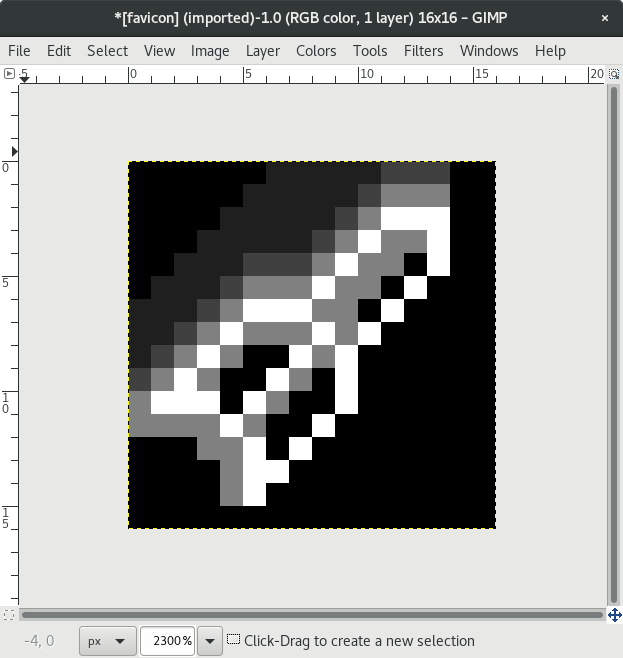
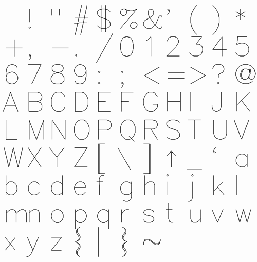
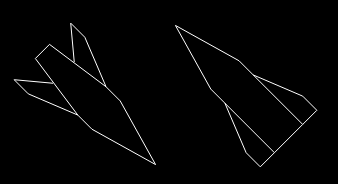

# SPACEWAR ALMOST FROM SCRATCH
This is an attempt of reproducing the game [spacewar!](https://en.wikipedia.org/wiki/Spacewar!) using modern programming languages. The idea is to track the progress and time each stage of development in this document. If possible, I want to finish this project in under 24h.

Check it out [here](https://armlessjohn404.github.io/spacewar-almost-from-scratch/)

The game is based in `html5 canvas`, `CSS` and `ES6 javascript`. No extra libraries or engines will be used.

Since I've already worked on a project to reproduce [PONG](https://armlessjohn404.github.io/spacewar-almost-from-scratch/), I'll be using much of it in here.

## GOALS
* ~~Add `LICENSE.md` and `README.md`~~
* ~~Create `html/canvas` base~~
* ~~Host somewhere~~
* ~~Create the gameloop~~
* ~~Create rendering functions~~
* ~~Design board~~
* ~~Create `Ship` class~~
* ~~Create `Shot` class~~
* ~~Create `blackhole` sprite~~
* ~~Implement gravity mechanics~~
* Implement collision mechanics
  ~~* Collision with the black hole~~
  ~~* Collision with the borders~~
  * Collision between Ships
  * Collision between Shots
  * Collision Ship-Shots
* Create gameover screen
* Create start screen
* Create credits screen
* Create enemy AI
* Add sounds
* Improve webpage
* Get playtesters feedback
* List requests/bugs
* Fix requests/bugs
* Finished!

## Progress Reports
00:00 - Start! This project started October 6th, 2016 at 17:50 (BRT). I'll be timing each step and will be placing the time it took from the beginning along with the achieved goal.

## 00:10 - LICENSE and README
This project is under a [GNU GPL3](https://www.gnu.org/licenses/gpl-3.0.en.html). Have fun! :wink:

## 00:15 - Host somewhere
For now, I'll be hosting it in [github pages](https://pages.github.com/) since it's easy deploy. Check it out [here](https://armlessjohn404.github.io/spacewar-almost-from-scratch/)

## 00:40 - `html/canvas` base + gameloop
I'll be borrowing the gameloop and the base from my other project [spacewar-almost-from-scratch](https://armlessjohn404.github.io/spacewar-almost-from-scratch/).
The favicon was made with GIMP.



And here is the webpage!!
#### Hello World Again


## 04:00 - Create rendering functions
To stay true to the game origins, I'll draw only with vectors using `ctx.lineTo` method. One function was created that receives an `Array` of coordinates and draws the lines on screen.

```javascript
function drawArray(array, width=1, color="#FFF") {
  // setup style
  Game.context.lineWidth = width;
  Game.context.strokeStyle = color;
  // go to starting position
  Game.context.beginPath();
  Game.context.moveTo(...array[0]);
  array.shift();
  // draw line
  array.forEach((value) => Game.context.lineTo(...value));
  Game.context.stroke();
}
```

It would be really boring to draw letters with vectors by hand, luckly I've found a set of characters made of vectors, called [Hershey Vector Font](http://paulbourke.net/dataformats/hershey/). This character set was invented in 1967, 5 years after `Spacewar`.



In this set, each letter in the alphabeth is a series of characters that corresponds to coordinates. Eg: `M=-5`, `N=-4`, `O=-3` ...

```javascript
alphabeth = {
  "A": "9MWRMNV RRMVV RPSTS",
  "B": "16MWOMOV ROMSMUNUPSQ ROQSQURUUSVOV",
  "C": "11MXVNTMRMPNOPOSPURVTVVU",
  "D": "12MWOMOV ROMRMTNUPUSTURVOV",
  "E": "12MWOMOV ROMUM ROQSQ ROVUV",
  "F": "9MVOMOV ROMUM ROQSQ"
  ...
}
```
I then made a parser for this character set to transform it's language into the vectors to be drawn.
With that, I created a function that receives `strings` and writes them in the screen. Also two more functions to make it easier to draw stuff: `drawCircle`, `drawPoint`.


## 04:20 - Board Design
The board in this game is just some stars in the background. I made the play area round, so I'm drawing a circle to show that. The stars are generated randomly in each round.


## 08:20 - `Ship` class
The ship class is a sprite that has it's own `draw` and `update` methods. They're called in the gameloop. The key bindings were partially done and easy to implement, since I'm using a helper object `Key` in the gameloop. This class ended up bigger than I expected, and I still need to implement somethings that are not ready yet.

The vectors were hand drawn and based on the original game. I changed a little the sprite of `player2`. In the original game it has a slimmer profile, then it's a little harder to hit it.
```javascript
let player1Vectors = [
  [[8, 0], [1, 2], [-1, 2], [-8, 1], [-8, -1], [-1, -2], [1, -2], [8, 0]],
  [[-1,  2], [-6,  4], [-8,  4], [-5,  1.5]],
  [[-1, -2], [-6, -4], [-8, -4], [-5, -1.5]]
]
```



It was quite tricky to rotate all the vectors in the sprite around a center. For that I created a method `updateRotation` that have an optional argument `angle` to set the property in the object and perform a rotation around the center of the sprite.

When the thrusters (`keyDown`) are activated, one vector shoots out of the rear of the ships with a random length for each frame. This effect ended up very similar to the original one.


## 10:40 - `Shot` class
The `Shot` class is much simpler than `Ship`. It has just to start somewhere, move in the correct direction and end after a certain distance. It is created when the player presses the `keyUp` in the `Ship` class.


## 11:00 - `Blackhole` class
The blackhole is a simple sprite in the middle of the screen. It generates two random numbers every frame: One for the length of the vector and one for the angle.


## 11:20 - Add gravity mechanics
A function was created to handle the gravity mechanics. It's called in the gameloop's update method passing the `Ship` instances, the center of pull an the gravity as arguments.
```javascript
function addGravity(element, cx, cy, gravity) {
  // F = Gm1m2/r^2 = gravity/r^2
  let dx = element.x-cx;
  let dy = element.y-cy;
  let F = gravity/(Math.pow(dx, 2)+Math.pow(dy, 2));
  let angle = Math.atan2(dx, dy)
  let fx = -F*Math.cos(angle);
  let fy = -F*Math.sin(angle);
  element.speedX += (fx<MAXACCEL?fx:MAXACCEL);
  element.speedY += (fy<MAXACCEL?fy:MAXACCEL);
}
```


## Implement collision mechanics
### 11:35 - Collision with the black hole
The black hole spawns any Ship that reaches its position to a random position in the board with `speed=0`.
### 12:20 - Collision with the borders
The game board wraps around itself, making it infinite. So, whenever a player or shot reaches the borders, they're spawned back in the other side of the board.
