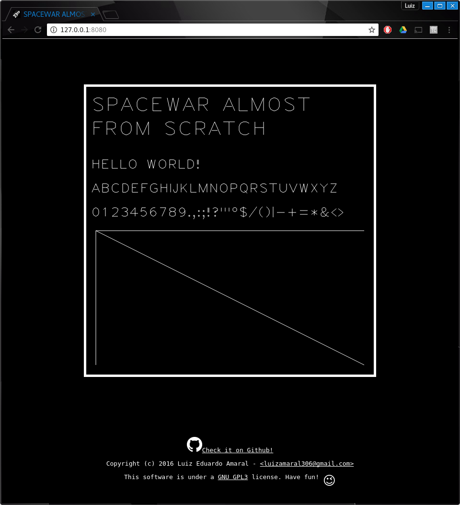

# SPACEWAR ALMOST FROM SCRATCH
This is an attempt of reproducing the game [spacewar!](https://en.wikipedia.org/wiki/Spacewar!) using modern programming languages. The idea is to track the progress and time each stage of development in this document. If possible, I want to finish this project in under 24h.

Check it out [here](https://armlessjohn404.github.io/spacewar-almost-from-scratch/)

The game is based in `html5 canvas`, `CSS` and `ES6 javascript`. No extra libraries or engines will be used.

Since I've already worked on a project to reproduce [PONG](https://armlessjohn404.github.io/spacewar-almost-from-scratch/), I'll be using much of it in here.

## GOALS
* ~~Add `LICENSE.md` and `README.md`~~
* ~~Create `html/canvas` base~~
* ~~Host somewhere~~
* ~~Create the gameloop~~
* ~~Create rendering functions~~
* Design board
* Create `ship` class
* Create `blackhole` sprite
* Implement gravity mechanics
* Implement collision mechanics
* Create gameover screen
* Create start screen
* Create credits screen
* Create enemy AI
* Add sounds
* Improve webpage
* Get playtesters feedback
* List requests/bugs
* Fix requests/bugs
* Finished!

## Progress Reports
00:00 - Start! This project started October 6th, 2016 at 17:50 (BRT). I'll be timing each step and will be placing the time it took from the beginning along with the achieved goal.

00:10 - LICENSE and README
This project is under a [GNU GPL3](https://www.gnu.org/licenses/gpl-3.0.en.html). Have fun! :wink:

## 00:15 - Host somewhere
For now, I'll be hosting it in [github pages](https://pages.github.com/) since it's easy deploy. Check it out [here](https://armlessjohn404.github.io/spacewar-almost-from-scratch/)

## 00:40 - `html/canvas` base + gameloop
I'll be borrowing the gameloop and the base from my other project [spacewar-almost-from-scratch](https://armlessjohn404.github.io/spacewar-almost-from-scratch/).
The favicon was made with GIMP.


And here is the webpage!!
#### Hello World Again


## 04:00 - Create rendering functions
To stay true to the game origins, I'll draw only with vectors using `ctx.lineTo` method. One function was created that receives an `Array` of coordinates and draws the lines on screen.

```javascript
function drawArray(array, width=1, color="#FFF") {
  // setup style
  Game.context.lineWidth = width;
  Game.context.strokeStyle = color;
  // go to starting position
  Game.context.beginPath();
  Game.context.moveTo(...array[0]);
  array.shift();
  // draw line
  array.forEach((value) => Game.context.lineTo(...value));
  Game.context.stroke();
}
```

It would be really boring to draw letters with vectors by hand, luckly I've found a set of characters made of vectors, called [Hershey Vector Font](http://paulbourke.net/dataformats/hershey/). This character set was invented in 1967, 5 years after `Spacewar`.


In this set, each letter in the alphabeth is a series of characters that corresponds to coordinates. Eg: `M=-5`, `N=-4`, `O=-3` ...

```javascript
alphabeth = {
  "A": "9MWRMNV RRMVV RPSTS",
  "B": "16MWOMOV ROMSMUNUPSQ ROQSQURUUSVOV",
  "C": "11MXVNTMRMPNOPOSPURVTVVU",
  "D": "12MWOMOV ROMRMTNUPUSTURVOV",
  "E": "12MWOMOV ROMUM ROQSQ ROVUV",
  "F": "9MVOMOV ROMUM ROQSQ"
  ...
}
```
I then made a parser for this character set to transform it's language into the vectors to be drawn.
With that, I created a function that receives `strings` and writes them in the screen.

